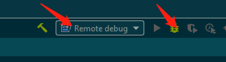

* How to generate DAO?
  * run mvn mybatis-generator:generate
  * How to avoid duplicate id in xxxMapper.xml
* How to config the port?
    * It is configured by Jetty in this repo
      ```
      jetty:run -Djetty.port=10086
      ``` 
* How to run ssm?
* How to build ssm?
* How to deploy as  jar without jetty? 
* How to deploy as war in jetty? 
    * specify config in pom.xml
    ```
    <packaging>war</packaging>
    ```
    * run mvn command
    ```
    mvn clean && mvn package
    ```
    * Download jetty, assume directory: D:\jetty-9.4.24
      * copy MySSM.war to webapps/
      
      * run java command
      ````
      java -jar start.jar
      ````
      * Note: default port is 8080. It seems that 8080 port is also important
* How to debug remote jvm?
    * add parameter when start jetty in D:\jetty-9.4.24
        ```
        java -jar -agentlib:jdwp=transport=dt_socket,server=y,suspend=n,address=5005 start.jar
       ```
       
    * Check if it works
        * http://127.0.0.1:8080/MySSM/user/1
        
    * set remote config, it looks like:
       
    * how to run remote debug
        
        * select remote-debug
        * click the bug icon
    * time consuming: 15mins
    *  Summary
        *　服务端运行良好
        *  服务端必须开一个口子
        *  客户端截获这个口子
        *  客户端的源代码和服务端的 war包必须一致
* why code step into spring framework in debug mode?
* It is better not to set absolute path for database driven?  
* How to implement hot reload?
* How to verify SSM?
  * default URL: http://localhost:10086/user/1
  * home page: http://localhost:10086/index.jsp
